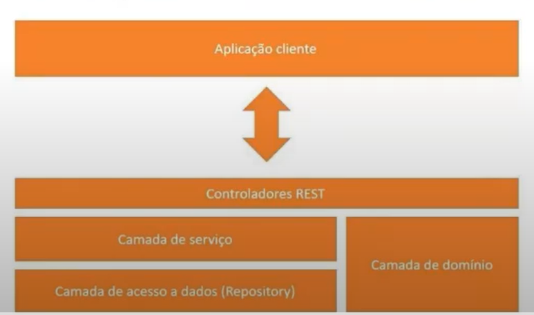
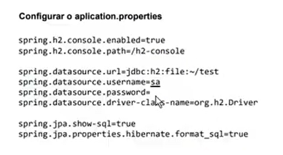
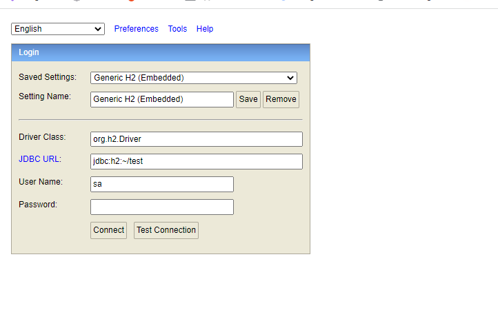
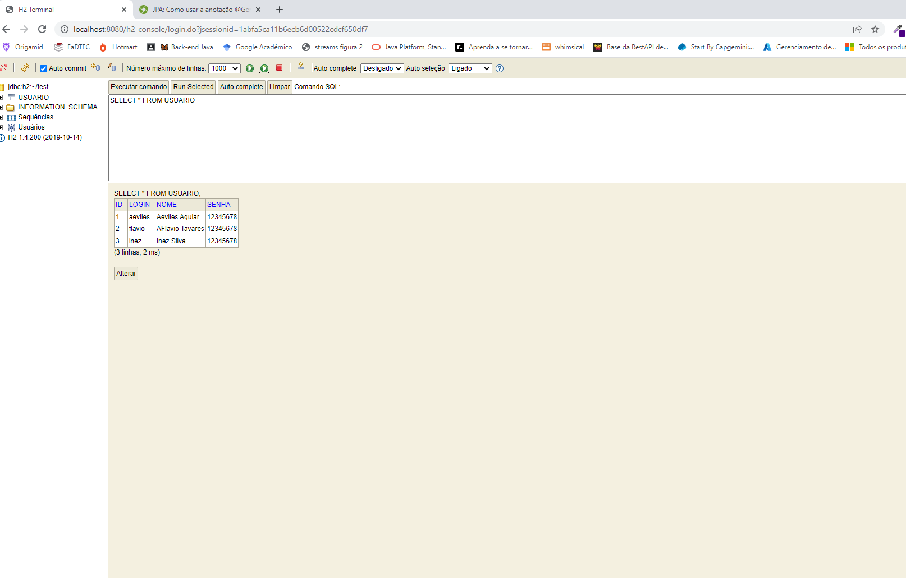

# Spring Boot API Rest

Desenvolvimento em Camadas.

Teremos uma aplicação client que nesse caso é o POSTMAN.
Ele vai enviar requisições para a nossa API , a nossa API recebe as requisições na camada 
de controladores REST, que é a camada que recebe as requisições do front ou do webService.

Essa camada de Controladores REST vai passar nossas requisições para a camada de 
Serviço, onde ficará as nossas lógicas de negócio. 

E validada todas as validações ele vai passar as requisições para a camada de acesso a
dados que é a camada Repository.

E ambas terão acesso a nossa camada de domínio.

Configurações

## Testando a aplicação

http://localhost:8080/h2-console/

conectando

https://www.youtube.com/watch?v=nWqSV6lYNPk&list=PLA8Qj9w4RGkXwPerFo4ZDFEessyNJW1ol&index=13

